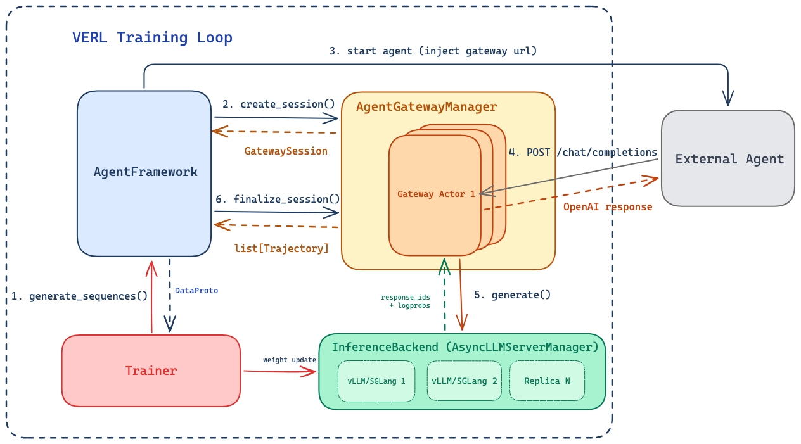
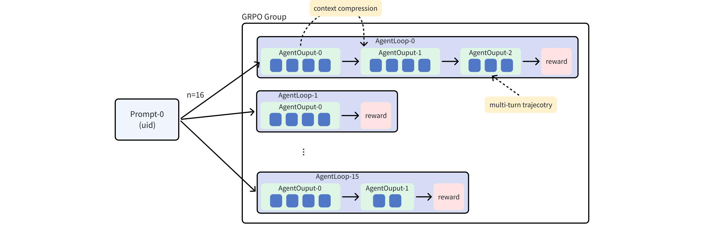

# [RFC] Agent Trajectory Gateway for VERL

## Summary

This RFC proposes two new abstractions for VERL's agent-based reinforcement learning pipeline:

1. **AgentFramework** — an abstract base class for agent lifecycle management and reward computation, replacing the current tight coupling between `AgentLoopManager` and specific agent implementations.
1. **AgentGateway** — an independent HTTP service that intercepts agent LLM calls via the OpenAI Chat Completions API, performs canonical tokenization, and assembles token-level trajectory data with strict token-truth guarantees.

Together, they enable any OpenAI-compatible agent system to be integrated into VERL's training loop without modifications to agent code, while producing continuous multi-turn trajectories with loss masks directly consumable by VERL's training engine.

## Motivation

VERL's current agent integration (`AgentLoopManager` + `AgentLoopBase`) tightly couples three concerns: LLM infrastructure management, agent lifecycle, and trajectory collection. This creates friction when integrating new agent types:

- Each new agent framework requires dedicated adapter code inside the agent loop.
- Trajectory collection logic is embedded in the agent loop itself, making it non-reusable.
- Only coroutine-based agents are natively supported; subprocess and remote agents require ad-hoc integration (e.g., SWE-Agent's custom `ModelProxy`).

Community contributions such as AWS AgentCore (PR #4216) and Aliyun Remote Agent (Issue #5737) further demonstrate the need for a pluggable agent abstraction that cleanly separates these concerns.

This RFC addresses these issues by:

1. **Defining** `AgentFramework` as the standard interface for agent-based rollout. Existing `AgentLoopBase` implementations (ToolAgentLoop, ReactAgentLoop, SWEAgentLoop) continue to work through a bridge implementation. New agent types only need to implement two methods: `run_session` and `compute_reward`.
1. **Extracting trajectory collection into** `AgentGateway`, an independent service that works with any Framework implementation. The Gateway handles tokenization, token drift prevention, and trajectory assembly — concerns that are orthogonal to how agents are launched or managed.
1. **Extracting infrastructure management** (LLM server initialization, load balancing, worker allocation) out of the agent layer, so that `AgentFramework` focuses purely on agent logic.

## Design Overview



### Architecture

```text
VERL Training Loop
│  Creates and owns: LLM servers, load balancer, GatewayManager, Framework
│
├── AgentGatewayManager
│     Manages multiple Gateway actors with session routing
│     ├── Gateway Actor 1 (Ray actor, FastAPI)
│     ├── Gateway Actor 2 (Ray actor, FastAPI)
│     └── Gateway Actor N (Ray actor, FastAPI)
│
├── AgentFramework (abstract, long-lived)
│     Agent lifecycle management
│     Reward computation
│     Batch orchestration + DataProto assembly
│
└── InferenceBackend (long-lived)
      Token-in-token-out generation via AsyncLLMServerManager
```

`AgentFramework` and `AgentGateway` are independent — the Gateway does not know which Framework implementation is using it, and the Framework does not know the Gateway's internal trajectory assembly logic. They interact only through a well-defined session API.

To avoid single-point bottlenecks, multiple Gateway instances run as Ray actors, each hosting a FastAPI HTTP server. An `AgentGatewayManager` routes session creation requests across Gateway actors (e.g., round-robin or least-loaded). Once a session is created on a specific Gateway actor, all subsequent requests for that session are pinned to that actor. This follows the same pattern as VERL's existing `GlobalRequestLoadBalancer` for LLM server replicas.

### Data Flow

A single session proceeds as follows:

1. **Framework** creates a session on the `AgentGatewayManager`, which selects a Gateway actor and returns a session-specific `base_url`.
1. **Framework** starts the agent (subprocess, coroutine, or remote call), injecting the `base_url` as the agent's LLM endpoint.
1. **Agent** makes standard OpenAI Chat Completion requests to the assigned Gateway actor. On each request, the Gateway tokenizes, checks prefix consistency, routes to the inference backend, records the token-level interaction, and returns a standard OpenAI response. The agent is unaware of the interception.
1. **Agent** completes (process exits, coroutine returns, or calls the optional `/complete` endpoint).
1. **Framework** finalizes the session via the `AgentGatewayManager`, receiving the assembled trajectories.
1. **Framework** computes trajectory-aligned rewards and packages the resulting samples into `DataProto`.

## AgentFramework

### Interface

```python
Reward = float | dict[str, float]

class AgentFramework(ABC):

    def __init__(self, gateway_manager: AgentGatewayManager, config: DictConfig):
        self.gateway_manager = gateway_manager
        self.config = config

    async def generate_sequences(self, prompts: DataProto) -> DataProto:
        """Process a batch of prompts through agent sessions.

        Default implementation handles batch splitting, concurrent session
        execution, Gateway session lifecycle, trajectory collection, and
        DataProto assembly. Can be overridden for custom strategies.
        """
        results = []
        async with self._batch_context(prompts) as sessions:
            results = await asyncio.gather(
                *[self._run_single(ep) for ep in sessions]
            )
        return self._to_dataproto(results)
        ...

    async def _run_single(self, ctx: SessionContext) -> SessionResult:
        # Internal method called by generate_sequences for each prompt
        session = await self.gateway_manager.create_session(ctx.session_id)
        try:
            agent_result = await self.run_session(ctx.prompt, session)
            trajectories = await self.gateway_manager.finalize_session(
                ctx.session_id
            )
            reward_output = await self.compute_reward(trajectories, agent_result)
            if isinstance(reward_output, list):
                rewards = reward_output
                assert len(rewards) == len(trajectories)
            else:
                rewards = [reward_output] * len(trajectories)
            return SessionResult(trajectories=trajectories, rewards=rewards)
        except Exception:
            await self.gateway_manager.abort_session(ctx.session_id)
            raise
        ...

    @abstractmethod
    async def run_session(
        self, prompt: str, session: GatewaySession
    ) -> AgentResult:
        """Run a single agent session.

        The agent's LLM calls must be routed to session.base_url.
        How the agent is started is entirely up to the implementation.
        """
        ...

    @abstractmethod
    async def compute_reward(
        self, trajectories: list[Trajectory], agent_result: AgentResult
    ) -> Reward | list[Reward]:
        """Compute reward for a completed session.

        Return a single Reward to broadcast to all trajectories in the
        session, or return one Reward per trajectory.
        """
        ...
```

Subclasses only need to define `run_session` (how to start and wait for the agent) and `compute_reward` (how to score the completed session and its resulting trajectories). The batch orchestration, session lifecycle, error handling, and DataProto assembly are handled by the base class.

### Reward Computation

Reward sources vary across agent types. SWE-Agent reward comes from test execution results; coding agents may use compilation success; dialogue agents may use external evaluators. The `compute_reward` method receives the completed session trajectories plus the `AgentResult` (which can carry agent-specific output and reward-related information), giving implementations full flexibility in how rewards are computed.

Reward-related information reaches `compute_reward` through two paths depending on the execution model:

- **Framework-collected.** When the Framework can directly access agent output (subprocess stdout, coroutine return value), it parses the relevant information and stores it in `AgentResult.reward_info`. This is the common case for subprocess and coroutine agents.
- **Agent-uploaded.** When the agent runs remotely and the Framework has no direct access to its output, the agent can upload reward-related information via the Gateway's optional `/complete` endpoint. The Framework retrieves it with the finalized trajectories (`trajectory.reward_info`).

Reward return semantics are intentionally flexible:

- If `compute_reward` returns a single `Reward`, the Framework broadcasts it to every trajectory in the session.
- If `compute_reward` returns a `list[Reward]`, it must have the same length and ordering as `trajectories`.
- Implementations that only care about the final session outcome can return one session-level reward; implementations that want finer-grained control can assign different rewards to different trajectories.

### Reference Implementations

**VerlLoopFramework** bridges existing `AgentLoopBase` implementations into the new abstraction. It creates an `AgentLoopBase` instance (e.g., `ToolAgentLoop`) with its LLM client pointed at the Gateway session URL. Existing agent loop subclasses require minimal change — replacing direct `server_manager.generate()` calls with standard OpenAI client calls routed through the Gateway. This is the migration path for all current VERL agent loop implementations.

**CliAgentFramework** launches external agent programs as subprocesses, injecting the Gateway session URL via the `OPENAI_BASE_URL` environment variable. Any agent that uses the OpenAI Chat Completions API works without code changes. Completion is detected via process exit.

Custom implementations can support other execution models (remote services, cloud-hosted agents) by implementing `run_session` with the appropriate launch and completion detection logic. For remote agents without an external notification channel, the Gateway provides `wait_for_completion()` to block until the agent signals completion via the `/complete` endpoint (see below).

### Migration from AgentLoopManager

The current `AgentLoopManager` is refactored by extracting infrastructure concerns:

- **LLM server initialization, load balancer setup, and Ray worker allocation** are extracted from `AgentLoopManager` and managed at the training loop level, as they are shared infrastructure not specific to any agent implementation.
- **Batch dispatch, agent lifecycle, trajectory collection, reward computation, and DataProto assembly** are covered by `AgentFramework` and `AgentGateway`.

Existing `AgentLoopBase` subclasses (ToolAgentLoop, ReactAgentLoop, SWEAgentLoop, etc.) are not rewritten — they are used within `VerlLoopFramework`.

## AgentGateway

### Overview

Each AgentGateway instance is a Ray actor running a FastAPI HTTP server that exposes the OpenAI Chat Completions API. It manages multiple concurrent sessions, each maintaining independent trajectory state. The Gateway is the single canonical tokenization authority — all `messages → token_ids` conversions happen here, using the inference backend's tokenizer and chat template.

Multiple Gateway actors are managed by an `AgentGatewayManager`, which handles session routing and provides a unified interface to the Framework.

#### Gateway Manager and Scaling

Each Gateway actor manages its own sessions independently. The manager's only responsibility is routing — selecting which actor handles a new session and forwarding subsequent calls to the correct actor.

```python
class AgentGatewayManager:
    """Manages multiple Gateway actors with session routing."""

    def __init__(self, gateways: list[AgentGateway]):
        self.gateways = gateways
        self._session_to_gateway: dict[str, AgentGateway] = {}

    async def create_session(self, session_id: str) -> GatewaySession:
        """Select a Gateway actor (e.g., round-robin) and create a session."""
        gateway = self._select_gateway()
        session = await gateway.create_session.remote(session_id)
        self._session_to_gateway[session_id] = gateway
        return session

    async def finalize_session(self, session_id: str) -> list[Trajectory]:
        """Route to the correct Gateway actor and finalize."""
        gateway = self._session_to_gateway.pop(session_id)
        return await gateway.finalize_session.remote(session_id)

    async def abort_session(self, session_id: str) -> None:
        gateway = self._session_to_gateway.pop(session_id, None)
        if gateway:
            await gateway.abort_session.remote(session_id)

    async def wait_for_completion(self, session_id: str, timeout: float) -> None:
        gateway = self._session_to_gateway[session_id]
        await gateway.wait_for_completion.remote(session_id, timeout)
```

### Session Management

The Gateway provides a session API for Framework to manage session lifecycles:

```python
@ray.remote
class AgentGateway:

    def __init__(
        self,
        tokenizer: AutoTokenizer,
        chat_template: str,
        backend: InferenceBackend,
        config: GatewayConfig,
    ): ...

    async def create_session(self, session_id: str) -> GatewaySession:
        """Create a trajectory session."""
        ...

    async def finalize_session(self, session_id: str) -> list[Trajectory]:
        """Assemble and return trajectories, clean up session state.
        Returns one trajectory per prefix-consistent segment."""
        ...

    async def abort_session(self, session_id: str) -> None:
        """Discard session state."""
        ...

    async def wait_for_completion(self, session_id: str, timeout: float) -> None:
        """Block until agent calls /complete. For remote agents only."""
        ...
```

`create_session` returns a `GatewaySession` containing a session-specific `base_url` (e.g., `http://{gateway_host}:{port}/sessions/{session_id}/v1`). The agent uses this URL for all LLM calls, and the Gateway routes requests to the correct session by URL path. This approach requires no special headers or client modifications — the agent simply uses a different base URL.

### HTTP Endpoints

The Gateway exposes two endpoints per session:

`POST /sessions/{id}/v1/chat/completions` — Standard OpenAI Chat Completions. The agent calls this as its normal LLM endpoint. The Gateway intercepts the request, performs tokenization, routes to the inference backend, records the interaction, and returns a standard response. This is the only mandatory endpoint.

`POST /sessions/{id}/complete` — Optional. Allows the agent to explicitly signal session completion and optionally upload reward-related information. This is useful for remote agents that have no other completion notification channel, or for VERL-native agent loops that want to pass structured results. Agents that do not call this endpoint are unaffected — Framework detects completion through other means (process exit, coroutine return, etc.).

### Request Handling

On each Chat Completion request, the Gateway performs:

1. **Message-level prefix check.** Compare the incoming messages with the session's recorded message history using content hashes. If the prefix matches, only the new (incremental) messages are tokenized and appended to the accumulated token sequence. If the prefix does not match (due to context compression, truncation, or other agent-side modifications), the current trajectory segment is finalized and a new segment begins with full tokenization.
1. **Inference routing.** Send `prompt_ids` to the inference backend via its token-level generation API (`AsyncLLMServerManager`). Receive `response_ids` and `logprobs`.
1. **Interaction recording.** Record the turn's `prompt_ids`, `response_ids`, and `logprobs`. Update the session's accumulated token sequence and message history.
1. **Response reconstruction.** Detokenize the response and construct a standard OpenAI Chat Completion response for the agent. When tool calling is enabled, structured `tool_calls` fields are reconstructed from the raw token output.

### Trajectory Output

After a session completes, `finalize_session` assembles the recorded interactions into a `list[Trajectory]`. Each trajectory is a prefix-consistent, continuous token sequence that constitutes an independent training sample:

```python
@dataclass
class Trajectory:
    uid: str                         # Each prompt has a unique uuid from dataset
    session_id: int                  # Each group sampling has a session_id: [0, n)
    trajectory_id: int               # Each sampling outputs m trajectories: [0, m)
    reward_info: dict

    prompt_ids: list[int]
    response_ids: list[int]
    response_logprobs: list[float]
    loss_mask: list[int]             # 1 for response tokens, 0 for prompt
    ...
```

A session produces multiple trajectories when the Gateway detects a message prefix mismatch mid-session, possibly due to context compression, skill switching, etc. The Gateway does not need to understand *why* the context changed; it only enforces consistency within each trajectory. In the final `DataProto` output, each trajectory becomes one row.



## Extensions

### Multimodal Support

The Gateway architecture supports multimodal inputs via an optional preprocessor. When present, the Gateway applies the multimodal preprocessor during tokenization and stores processor outputs alongside token sequences. Specific processor adapters will be added as model support grows.

### Tool Call Reconstruction

For models that produce tool calls via special tokens, the Gateway uses a configurable tool parser to reconstruct structured `tool_calls` fields in the OpenAI response returned to the agent. The raw token sequence is always preserved as-is for training.

### Prefix-Sharing Storage

In scenarios with repeated sampling or partial context overlap, multiple trajectory segments may share common prefixes. Tree-structured storage could reduce memory and disk usage, but training-side benefits depend on algorithm-level support (e.g., DTA). This is deferred to future work pending further analysis.
